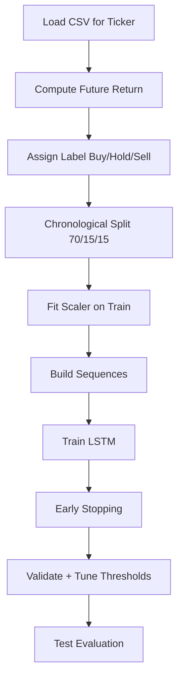
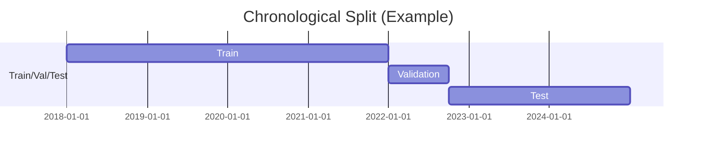
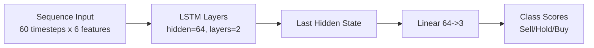

# MATOS LSTM Work Report

## Scope
This report summarizes the LSTM classification work completed in this workspace, the changes made, and how to run the training and evaluation.

## What Was Implemented

### 1) LSTM classification pipeline
- Implemented a PyTorch LSTM model for Buy/Hold/Sell prediction.
- Targets are derived from future returns at a configurable horizon.
- Chronological split is used: train/val/test = 70/15/15.
- Metrics: Accuracy and Macro F1 (per ticker).

### 2) Data handling and labeling
- Input data is read from data/csv/*.csv.
- For each ticker, the script uses the longest available CSV range.
- Future return labels are assigned using fixed thresholds:
  - Buy if return >= +1.5%
  - Sell if return <= -1.5%
  - Hold otherwise

### 3) Reproducibility
- Fixed random seeds (Python, NumPy, PyTorch).
- Deterministic CuDNN behavior enforced.

### 4) Overfitting mitigation and training stability
- Increased default training epochs to 60.
- Added early stopping with:
  - Patience
  - Min delta
  - Minimum epochs before stopping

### 5) Class imbalance handling
- Added per-ticker class distribution reporting.
- Added class-weighted loss using inverse frequency.

### 6) Threshold tuning
- Added optional validation-based threshold tuning for Buy/Sell probabilities.
- Grid search selects thresholds that maximize validation accuracy.

## Files Modified or Added
- lstm_forecast.py: main training/evaluation script.
- data/requirements.txt: PyTorch and version alignment for Python 3.13.
- REPORT.md: this report.

## Diagrams

### Training Pipeline Flow


### Data Split Timeline


### LSTM Architecture


## How To Run

### Install dependencies
```bash
pip install -r Matos/data/requirements.txt
```

### Run one ticker
```bash
python Matos/lstm_forecast.py --ticker INFY.NS --horizon-days 20 --seq-len 60 --epochs 80 --patience 10 --min-delta 0.0005 --min-epochs 15 --tune-thresholds
```

### Run all tickers
```bash
python Matos/lstm_forecast.py --horizon-days 20 --seq-len 60 --epochs 80 --patience 10 --min-delta 0.0005 --min-epochs 15 --tune-thresholds
```

## Notes and Observations
- Longer horizons (e.g., 60-126 days) tend to worsen class balance and reduce macro F1.
- Shorter horizons (5-20 days) usually improve label balance and accuracy.
- Threshold tuning can raise accuracy but may reduce macro F1 if one class dominates.

## Next Suggested Improvements
- Add technical indicator features (RSI, MACD, ATR, etc.).
- Try pooled multi-ticker model with ticker embeddings.
- Add learning rate scheduler and richer model configs.
- Use walk-forward validation for robust performance estimates.
